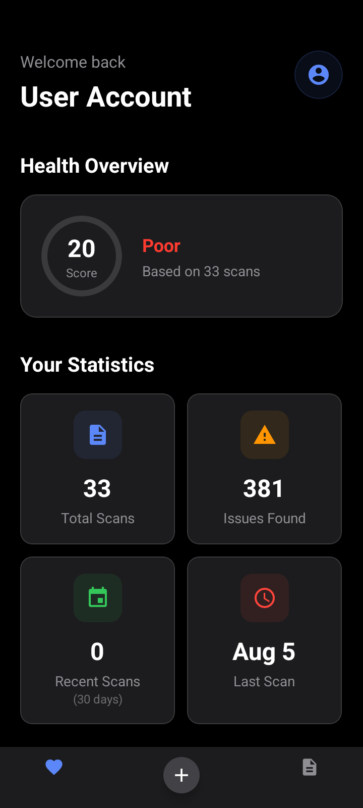
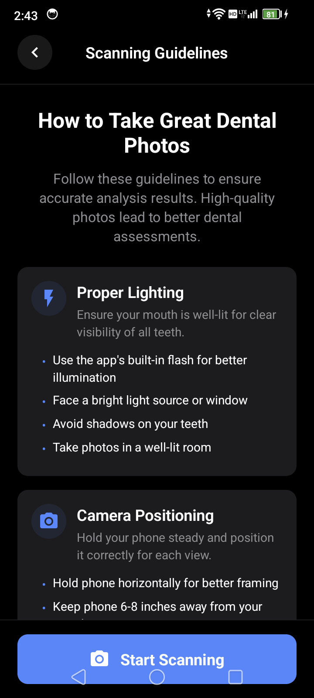
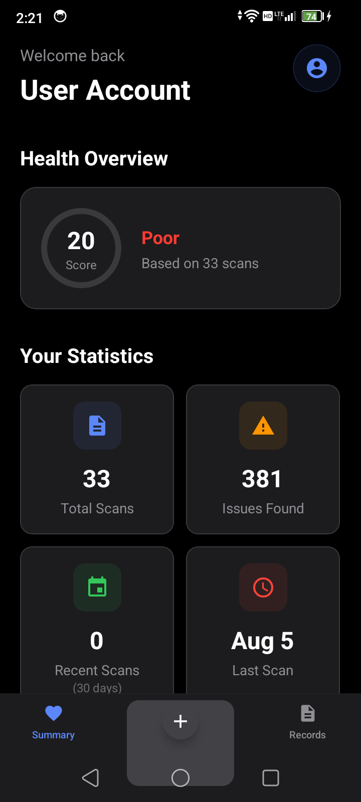
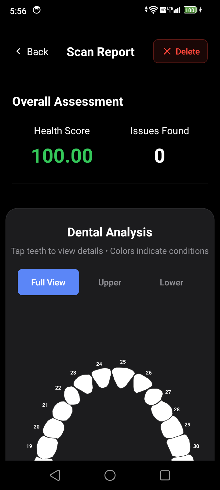
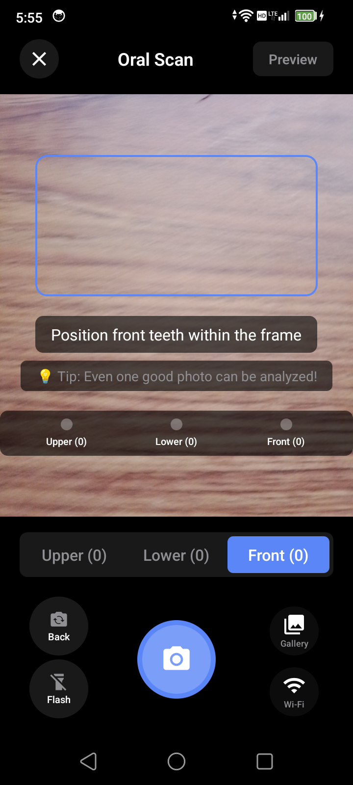

# Executive Report: OralScan App UI & Stability Overhaul
**Date:** September 18, 2025
**Status:** Weekly Progress Report
**Prepared For:** Dr. Wenyao Xu
**Prepared By:** Puru Soni (with assistance from Cascade AI)

---

### 1. Executive Summary

This report outlines a significant UI and stability overhaul conducted on the OralScan mobile application. The primary objective was to resolve critical layout issues on the Android platform that caused application UI elements to conflict with the operating system's native status and navigation bars.

Through a comprehensive, system-wide audit, we have successfully corrected these layout defects, resulting in a visually polished and professional user experience. Additionally, critical stability improvements were made to the camera functionality and core UI components. The application is now significantly more robust and user-friendly on our target Android hardware.

---

### 2. Development Environment Setup

Before any code changes could be made, a significant effort was required to establish a stable and functional development environment for the React Native project.

**Initial Challenges on Windows:**
The initial attempt to set up the environment on Windows proved to be a major roadblock. This involved installing and configuring Node.js, the Visual Studio C++ build tools, Android Studio, and the Expo framework. Despite correctly adding the Android Debug Bridge (ADB) to the system PATH, the environment was plagued by persistent configuration issues and build errors that prevented the application from running.

**Successful Migration to Linux:**
To overcome these obstacles, a strategic decision was made to switch to a Linux (dual-boot) partition. The setup process on Linux was significantly more streamlined and command-line driven. While it still required the same core components (Node.js, Expo, Android SDK), the configuration was less complex and ultimately successful.

**Device & USB Configuration:**
Once the base environment was running, the physical Android device was configured for development. This involved enabling USB debugging and establishing a reliable connection via ADB. This foundational work was critical for deploying, running, and debugging the application directly on the target hardware.

---

### 3. Background & Problem Diagnosis

Upon review, the application exhibited severe UI layout defects exclusively on the Android platform. Key screens, including the main tab bar, scan guidelines, and authentication flow, had content that would render underneath the system's transparent navigation and status bars. This created an unprofessional appearance and, in some cases, made UI elements completely inaccessible.

These platform-specific bugs were subtle and likely not apparent during the initial development phase, which was conducted by the previous developer, Long, on a macOS environment. Our first step was to diagnose the root cause: an incorrect implementation of `SafeAreaView` and hardcoded padding values that did not account for Android's handling of screen insets.

**Initial State Example - Overlapping UI:**
*The bottom navigation bar renders underneath the system's gesture navigation area, making it difficult to use.*

---

### 4. Comprehensive UI/UX Audit & Solution

To resolve these issues systematically, we performed a full-stack audit of every screen in the application. The core of the solution involved two key actions:

1.  **Standardizing `SafeAreaView`**: We replaced the legacy `SafeAreaView` component from `react-native` with the modern, more reliable implementation from `react-native-safe-area-context` across all screens.
2.  **Eliminating Manual Insets**: We removed all instances of hardcoded `paddingTop` values that were previously used as a workaround for the status bar, allowing the new `SafeAreaView` to manage screen insets automatically and correctly.

This audit covered the authentication flow, the main tab bar layout, and all detail/report screens, ensuring a consistent and correct layout across the entire user journey.

**Before and After - Scan Guidelines Screen:**
*Previously, the "Start Scan" button was partially obscured by the navigation bar. This has been corrected.*

---

### 5. Key Fixes Implemented

#### 5.1. System-wide Layout Correction
The audit and subsequent fixes have resolved all identified layout issues, creating a clean, edge-to-edge user experience that respects the device's physical boundaries.

**Additional Examples of Fixed UI:**
*The "+" button was previously rendered incorrectly within the navigation area.*

*The report screen is now properly inset, with all elements clearly visible and accessible.*

#### 5.2. Camera Stability Enhancement
A critical bug was identified where the camera view would go black after being flipped between the front and rear-facing modes. This issue was traced to the camera component being unnecessarily remounted on every state change.

**This issue was successfully resolved by modifying the `OptimizedCamera.tsx` component to prevent remounting, resulting in a smooth and seamless camera switching experience.** This fix was crucial for ensuring the core scanning functionality of the app is reliable for the user.

**Updated Camera View:**
*The camera now functions correctly after implementing the stability fix.*

---

### 6. Conclusion & Next Steps

This week's efforts have dramatically improved the stability and visual fidelity of the OralScan application on our target Android platform. By conducting a thorough audit and implementing standardized, modern solutions, we have eliminated a class of critical UI bugs and improved the core camera functionality.

The application is now in a much stronger position for further development and user testing.

---
